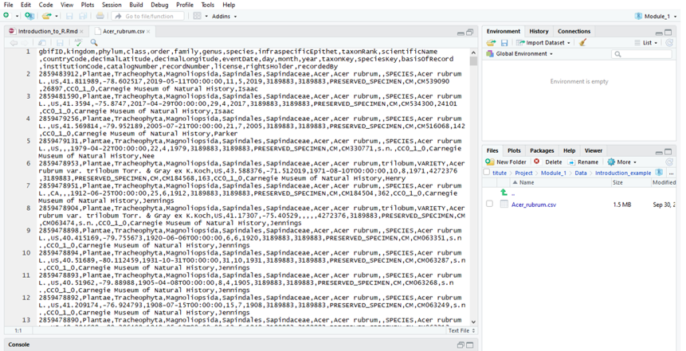
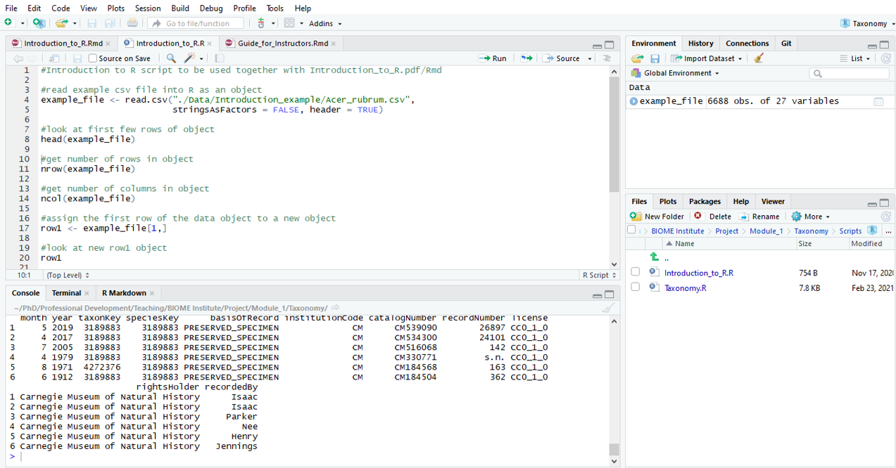
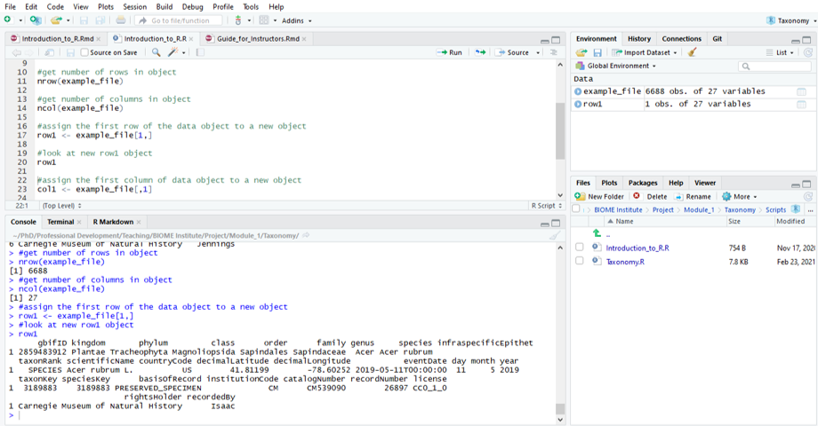
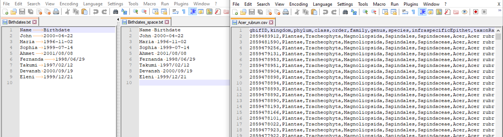
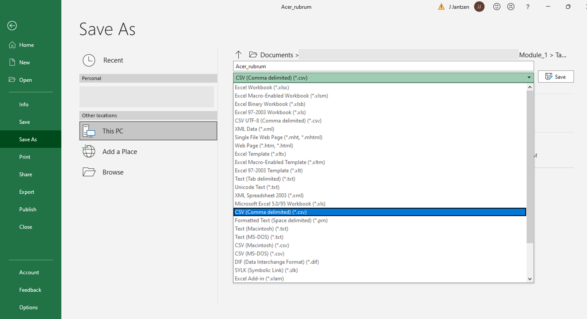

Welcome to "Understanding taxonomy," a module in the "Using phylogenies to study trait evolution" series.

In this module, we will learn how to download a list of taxa and their corresponding Taxon IDs from an online database: the Open Tree of Life. 

In future modules, we will use these taxa to create phylogenies and study how morphological or ecological traits have evolved for these taxa. 

Before completing this module, if you have no prior experience with R, it is best if you watch this short *[youtube video](https://www.youtube.com/watch?v=5YmcEYTSN7k)* describing the RStudio interface. Beginners may also choose to read through either *[Getting Started with R and RStudio](https://ourcodingclub.github.io/tutorials/intro-to-r/)* or *[Introduction to R with Biodiversity Data Chapter 3](http://mlgaynor.com/BLUE-Intro2RwithBiodiversityData/_book/pre-activity.html)*. You do not need to complete the steps in these tutorial portions for this module (all code and packages for this module are provided within this project), but these resources should provide relevant introductory background on RStudio, R Projects, running scripts, writing code, and troubleshooting. 

This course has several streams and several difficulty levels. Please choose the appropriate datafiles and scripts according to your goals.

Data for each module are generally included as **csv** files. These files are able to be opened manually or using an R script. Each **csv** file contains columns separated by **commas** ( , ) and rows separated by **new line characters**.

Navigate to the "Data" folder in the "Files" tab (bottom right corner of the screen) and within that, to the "Introduction_example" folder. Open the file "Acer_rubrum.csv" **manually** by clicking on it and selecting "View File" and check it out. It should look like this:

```{r, echo = FALSE, out.width = "75%", fig.cap = "Screenshot of csv file as opened manually"}

#

```

Now, make sure you have the Introduction_to_R.R script open in the Script tab (found in the Scripts folder in the Files tab, open by clicking on it). Using the first lines of code, open the same **csv** file using **R** code. To run the code, select (highlight) the row(s) of text and click the "Run" button above and "Run Selected Lines". Alternatively, selected lines of code can be run by simultaneously pressing the *ctrl* (*control*) and *enter* keys (Windows) or the *command* (*cmd*) and *enter* (or *return*) keys (Mac).

*Note: copying code from the pdf instructions into the console or a new script will likely not work due to formatting errors. Please open the script provided and run the code directly from there.

```{r reading_csv_file}

example_file <- read.csv("../Data/Introduction_example/Acer_rubrum.csv", stringsAsFactors = FALSE, header = TRUE)
head(example_file)

```

```{r echo = FALSE, out.width = "75%", fig.cap = "Screenshot of RStudio interface with head of $example file$"}


```

We can use several functions to learn more about our dataset. For example, we can use *nrow()* to count how many rows there are in the dataset. Try it now. How many rows are there? What about columns?

```{r counting_rows}
nrow(example_file)

ncol(example_file)

```

You will notice that we are using the **object** *example_file* to refer to the dataset. **Objects** are easy ways to assign large amounts of information to a single string of letters and/or numbers. 

Let's assign a single individual row to a new object: *row1*

```{r assigning_object}

row1 <- example_file[1,]

```


In this example, we are assigning the **object** *row1* the value of *example_file[1,]* which represents the first row and all columns of the **object** *example_file* using the **operator** *<-* . Let's see what that looks like. Here, rather than asking to see a subset of the data, as we did above with the *head()* **function**, we can run the **object** itself and see the whole thing. 

```{r view_object}

row1

```

```{r echo= FALSE, out.width = "75%", fig.cap= "Screenshot of $nrow$, $ncol$, and $row1$ lines of code"}



```

Let's see what just the first column of the original data would look like. 

```{r subset_column}

col1 <- example_file[,1]
head(col1)

```


Sometimes it's hard to visualize lots of data at once, which is why the summary tools, viewing a subset, or viewing the structure of the dataset can be useful. 

``` {r summary}

str(example_file)

```

Another important element is the concept of **classes** of **objects**. If the data is a number, it is often stored as a *numeric* or *integer* **class** while words or other groups of letters are stored as *character* **classes**. If you look at column *kingdom*, for example, you can see that it has the **class** *character* while the *gbifID* which is composed of numbers, is stored as *numeric*.

File formats and file typs are very important when manipulating data. As described above, **csv** files are **comma** delimited, meaning that columns are separated by **commas** ( , ) and rows are separated by **new line characters**. Another file type is **tab** delimited files, where columns are separated by **tabs** (a type of **white space**). The ending of a filename often gives a clue to what type of file it is; **comma** delimited files are typically saved as *.csv* while **tab** delimited files are often saved as *.txt*. To compare with the **csv** file we looked at earlier, let's look at a **txt** file. 

```{r birthdates}

#Read in the tab-delimited file using the read.delim function - you need to specify that the character "\t" is used to separate columns (the backslash is used to "excape" the t, which means that you are referring to a tab, not the letter t)
txt_file_example_1 <- read.delim("../Data/Introduction_example/Birthdates.txt", sep = "\t", stringsAsFactors = FALSE, header = TRUE)

head(txt_file_example_1)

#If you specify that the separator is a space (" "), the file is not imported correctly, because the separator is actually a tab
txt_file_example_2 <- read.delim("../Data/Introduction_example/Birthdates.txt", sep = " ", stringsAsFactors = FALSE, header = TRUE)

head(txt_file_example_2)

#Alternatively, if the separator is actually a space and not a tab, the separator needs to be specified as sep = " "
#If you specify that the separator is a space (" "), the file is not imported correctly, because the separator is actually a tab
txt_file_example_3 <- read.delim("../Data/Introduction_example/Birthdates_space.txt", sep = " ", stringsAsFactors = FALSE, header = TRUE)

head(txt_file_example_3)


#To compare, read in the original csv file using the read.delim function, specifying that the separator is a comma
example_file_delim <- read.delim("../Data/Introduction_example/Acer_rubrum.csv", sep = ",", stringsAsFactors = FALSE, header = TRUE)

head(example_file_delim)

```


```{r echo = FALSE, out.width = "100%", fig.cap = "Screenshot of different file types in text editor"}


```
If you have trouble importing a file into R, check to make sure that the formatting of the file matches the format that you are specifying in your R code. Additionally, check to make sure that **white spaces** are being interpreted correctly (you can check for white spaces by toggling the "Show All Characters" or "Show White Space Characters" options in a text editor such as Notepad++). Spaces are typically represented by dots while tabs are represented by arrows. It is generally easiest to import files that contain multiple columns into R as **csv** files. To save your own data as a **csv** file, in Excel, you can go to "Save As" and for file type, specify "CSV (Comma delimited)" rather than "Excel Workbook" or whatever file type it was originally. 

```{r echo = FALSE, out.width = "75%", fig.cap = "Screenshot of how to save as .csv in Excel"}


```


To check if R has correctly imported your file, make sure you inspect it using the summary functions we introduced in this tutorial. You may need to reformat the resulting object to ensure it is in the right format for your analyses (as demonstrated in the Taxonomy.R script).

I think that is enough of an introduction for now so let's get into this module!